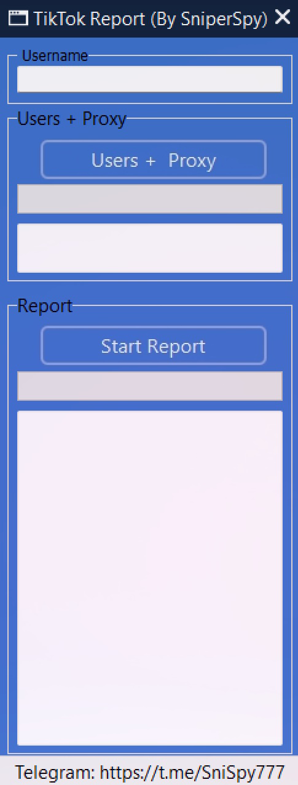

 <h1 align="center">🚀 TIKTOK REPORT TOOL</h1>  
<p align="center"></p>
TikTok report bot are a tool designed to automate the process of reporting accounts on TikTok that may violate the platform's policies. These bots can be used to mass-report accounts for spam, fake profiles, or other violations.

---

## ⚙️ STEPS FOR USE  
   <p>The program is easy to use, you only need the username of TikTok account.</p>
   <p>All accounts created via bulk are automatically included in the program.</p>
   <p>This program contains a lot of accounts created using automated software, the software is a bulk accounts application.</p> 
-----

## 🟢 GET THE TOOL
<p align="center"> 
  <b>Get the tool:</b><br>
  <a href="https://t.me/tiktokrepo"></a>
</p>  

---

**Legal Notice**

```console
I am not responsible for your actions.
```

----
